# Thermal Analysis and Mission-Oriented Selection of Martian Lava Tube Candidates

---

# Project Overview

The objective of this project was to build a complete scientific workflow for the:

* identification
* filtering
* thermal analysis
* ranking
* mission-oriented prioritization

of Martian lava tube candidates using:

* morphological cave catalogs
* THEMIS thermal inertia mosaics
* local thermal anomaly extraction
* regional volcanic analysis
* mission-driven scoring metrics

The final goal was not only to detect lava tube candidates, but to determine:

> which lava tubes are the strongest candidates for future robotic and human exploration missions on Mars.

---

# General Workflow

The complete workflow developed during the project was:

1. Global catalog cleaning
2. Morphological filtering
3. Priority-based selection
4. Regional selection (Tharsis focus)
5. THEMIS thermal tile assignment
6. Thermal feature extraction
7. Thermal anomaly analysis
8. Mission-oriented scoring
9. Scientific visualization
10. Final mission candidate selection

---

# Initial Dataset

The project started from two catalogs:

```text
Mars_Cave_Catalog.csv
Mars_Extended_Cave_Catalog.csv
```

These catalogs contained:

* latitude
* longitude
* morphology type
* diameter
* depth
* geological region
* priority information

for all known Martian cave and lava tube candidates.

---

# Global Candidate Cleaning

## Script

```python
filter_global_candidates.py
```

## Purpose

This script generated the first cleaned global dataset by:

* removing invalid entries
* normalizing coordinates
* keeping only meaningful geological structures
* preparing the catalog for thermal analysis

---

## Output Generated

```text
01_global_all_candidates_clean.csv
```

At this stage:

* the dataset became fully usable
* geographic consistency was ensured
* duplicate or incomplete entries were removed

---

# Regional Focus: Tharsis

## Script

```python
filter_candidates.py
```

## Purpose

A regional focus on the Tharsis volcanic province was created because:

* Tharsis contains the largest volcanoes on Mars
* lava tube formation is strongly connected to volcanic environments
* previous literature indicates high lava tube probability there

---

## Outputs

```text
01_tharsis_all_candidates.csv
02_tharsis_good_morphology.csv
03_tharsis_high_priority_shortlist.csv
04_tharsis_shortlist_for_thermal_analysis.csv
```

---

# Morphological Filtering

## Goal

Not all cave candidates are equally relevant.

The workflow prioritized morphologies more likely associated with:

* subsurface voids
* lava tube collapses
* skylight openings
* stable underground cavities

---

## Preferred Morphologies

The strongest morphology classes were:

* pit
* sky
* lat
* APC

depending on:

* geometry
* collapse alignment
* thermal behavior

---

# THEMIS Thermal Analysis

## THEMIS Data

The project used THEMIS thermal inertia mosaics such as:

```text
THEMIS_TI_Mosaic_00N000E_100mpp.tif
THEMIS_TI_Mosaic_00N120E_100mpp.tif
THEMIS_TI_Mosaic_00N180E_100mpp.tif
...
```

These maps contain thermal inertia measurements across Mars.

---

# Tile Assignment

## Script

```python
assign_themis_tiles.py
```

## Purpose

Each candidate was automatically associated with the correct THEMIS raster tile using:

* latitude
* longitude
* tile geographic boundaries

---

## Outputs

```text
05_required_themis_tiles_summary.csv
07_candidates_with_themis_tiles.csv
08_required_themis_tiles_summary.csv
```

---

# Thermal Feature Extraction

## Script

```python
extract_thermal_features.py
```

This was one of the most important parts of the project.

For every lava tube candidate, the script extracted:

* local thermal inertia
* surrounding thermal inertia
* local anomaly intensity
* z-score deviation
* thermal ranking metrics

---

# Thermal Metrics

## 1. Absolute Thermal Inertia

Measured using:

```text
TI_center_median_3x3
```

This represents the median thermal inertia in the local area around the candidate.

High values often indicate:

* consolidated rock
* thermally stable terrain

---

## 2. Thermal Anomaly

Computed as:

$\Delta TI = TI_{\text{center}} - TI_{\text{surrounding}}$

Stored in:

```text
Delta_TI
```

Interpretation:

* positive values → thermally distinct structures
* negative values → colder local terrain
* strong positive anomalies → potential underground cavities

---

## 3. Local Thermal Z-Score

Stored in:

```text
Local_TI_zscore
```

This measures how unusual the thermal behavior is compared to the surrounding area.

---

# Thermal Maps

## Script

```python
plot_thermal_maps.py
```

This script generated several global scientific visualizations.

---

# 1. Global Thermal Rank Score Map

## File

```text
thermal_maps/01_global_thermal_rank_score.png
```

## Meaning

This map visualizes all candidates color-coded by thermal rank score.

* yellow/green → strongest thermal signatures
* blue/purple → weaker candidates

---

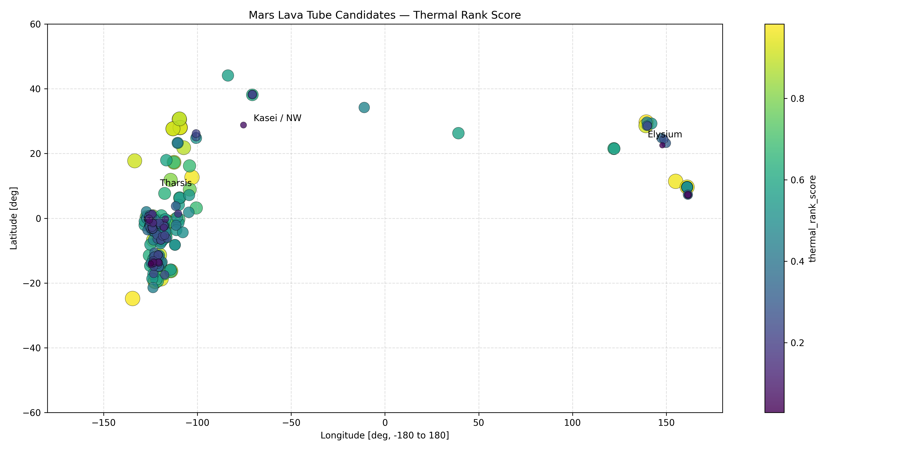

---

# 2. Local Thermal Anomaly Map

## File

```text
thermal_maps/02_global_delta_TI.png
```

## Meaning

This map shows local thermal anomalies.

* red → strong positive anomalies
* blue → negative anomalies

Positive anomalies are especially important because they may indicate:

* subsurface voids
* thermally insulated underground structures
* cave-like environments

---

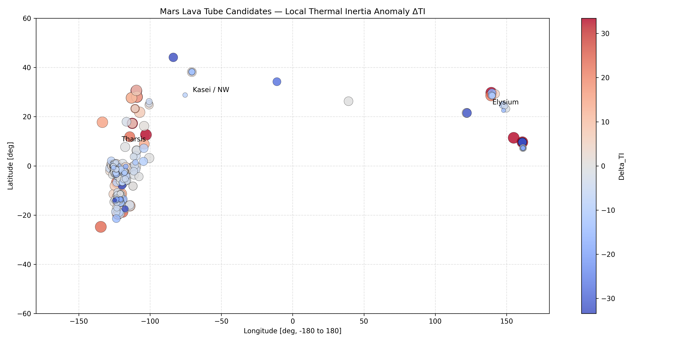

---

# 3. THEMIS Thermal Inertia Map

## File

```text
thermal_maps/03_global_TI_center.png
```

## Meaning

This visualization shows the absolute THEMIS thermal inertia.

High thermal inertia regions may correspond to:

* rocky volcanic terrain
* consolidated lava flows
* stable geological structures

---

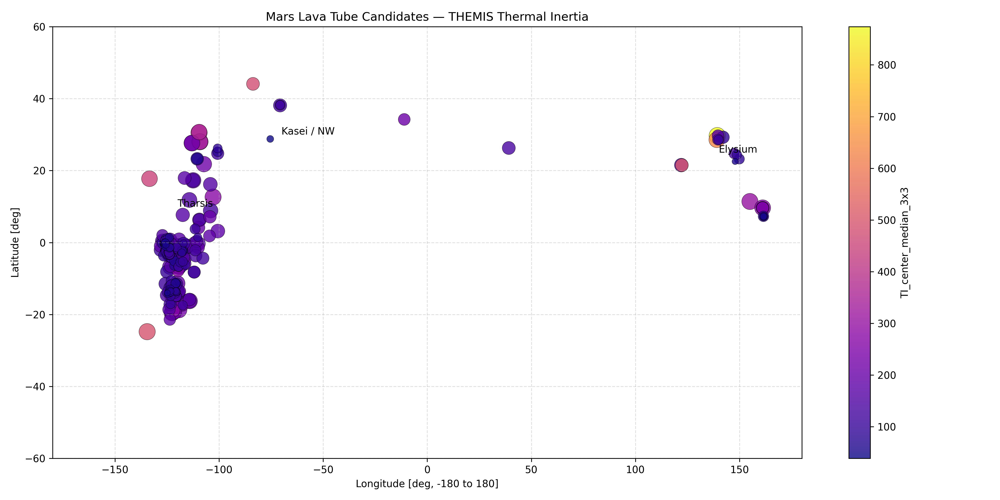

---

# 4. Top Thermal Candidates

## File

```text
thermal_maps/04_top20_thermal_candidates.png
```

## Meaning

This figure isolates only the strongest thermal candidates.

This solved the problem of:

* overlapping points
* unreadable global maps

and allowed direct visualization of the most interesting lava tubes.

---

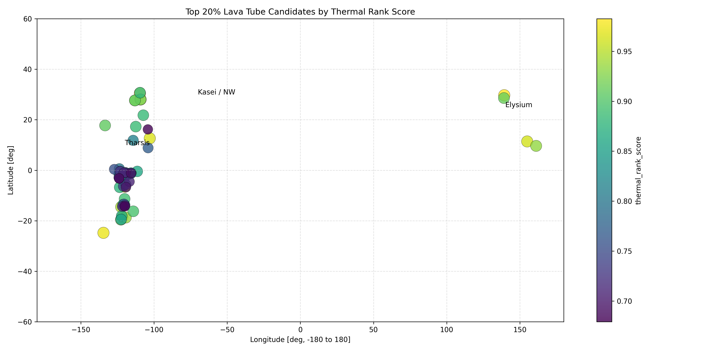

---

# 5. Morphological Distribution

## File

```text
thermal_maps/05_global_candidates_by_type.png
```

## Meaning

This map visualizes candidate morphology classes:

* APC
* pit
* sky
* lat
* end

This helped compare:

* morphology
* thermal anomaly behavior
* regional clustering

---

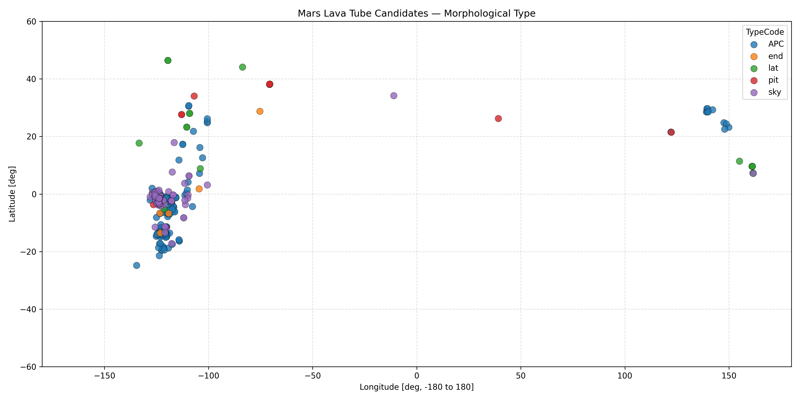

---

# Mission-Oriented Selection

## Script

```python
select_strongest_mission_candidates.py
```

---

# Why Mission-Oriented Ranking Was Necessary

Thermal inertia alone is not enough.

Some candidates had:

* high thermal inertia
  but:
* weak local anomalies

Others had:

* moderate thermal inertia
  but:
* extremely strong local contrast

Therefore, a multi-factor ranking system was created.

---

# Mission Scoring Components

The final mission score combined:

## Thermal Score

Based on:

* TI_center
* Delta_TI
* Local anomaly

---

## Morphology Score

Higher scores assigned to:

* pits
* skylights
* aligned collapse structures

because they are more likely to provide:

* underground access
* stable cavities

---

## Geometry Score

Included:

* diameter
* depth
* structural relevance

---

## Priority Score

Based on:

* original catalog scientific priority

---

# Mission Visualization Pipeline

## Scripts

```python
visualize_mission_selection.py
mission_selection_clear_visuals.py
```

These scripts generated the final scientific figures.

---

# Final Top 15 Mission Candidates

## File

```text
mission_selection_clear_visuals/02_top15_final_score.png
```

---

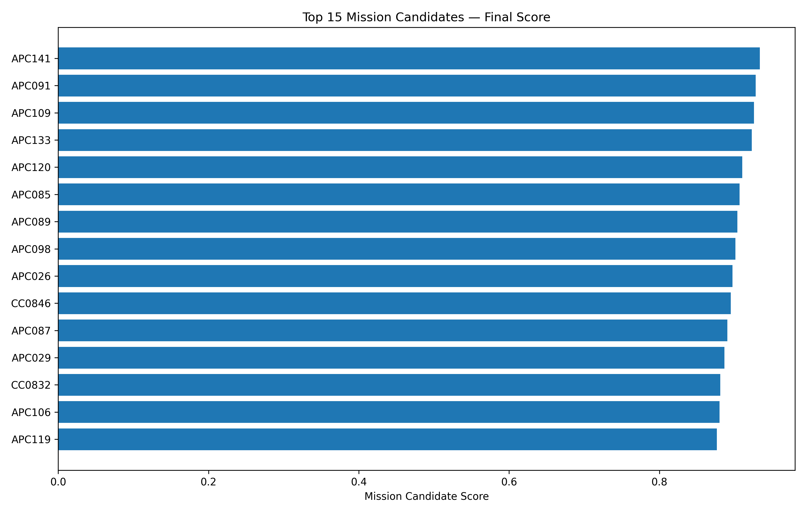

---

# Score Breakdown

## File

```text
mission_selection_clear_visuals/03_top15_score_breakdown.png
```

This is one of the most important figures of the project.

It explains:

* WHY each candidate ranks highly
* which components contribute most
* whether the strength comes from:

  * thermal behavior
  * morphology
  * geometry
  * scientific priority

---

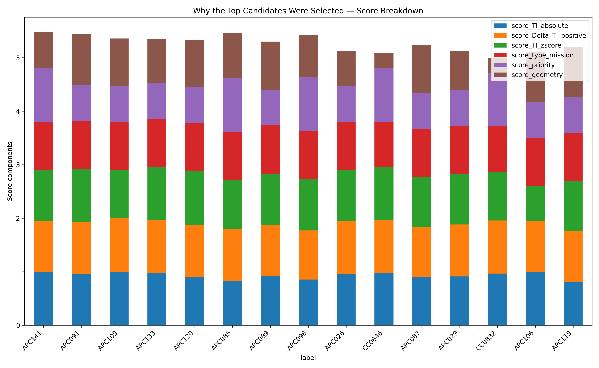

---

# Delta TI vs Morphology

## File

```text
mission_selection_clear_visuals/04_top30_deltaTI_vs_morphology_labeled.png
```

This figure studies the relationship between:

* thermal anomalies
* morphology type

It revealed that:

* pits
* skylights
* aligned collapses

often exhibit stronger local thermal signatures.

---

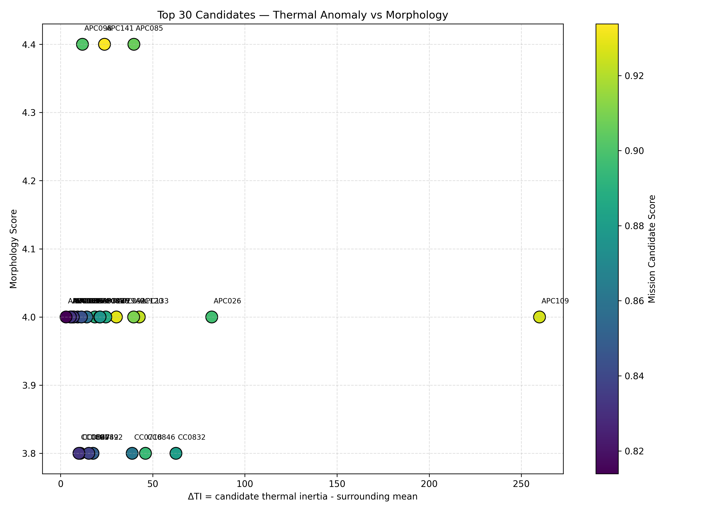

---

# Regional Zoom Maps

To solve the problem of overlapping points, the project generated regional zoom maps.

---

# Arsia Mons / South Tharsis


---

# Ascraeus / North Tharsis

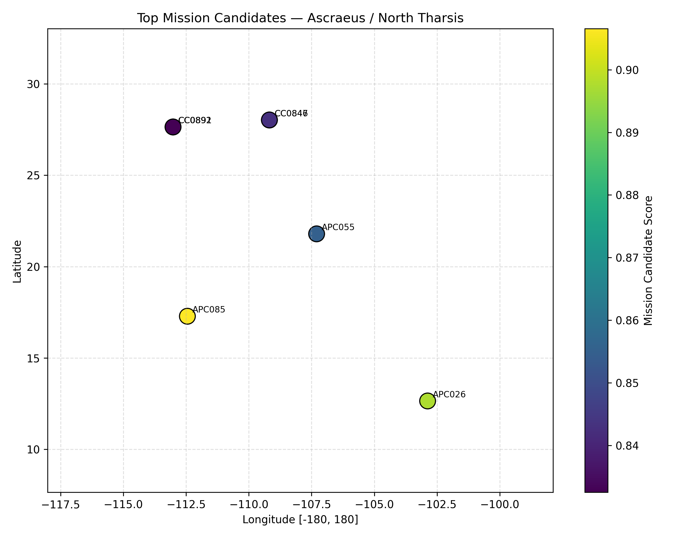

---

# Elysium / Cerberus

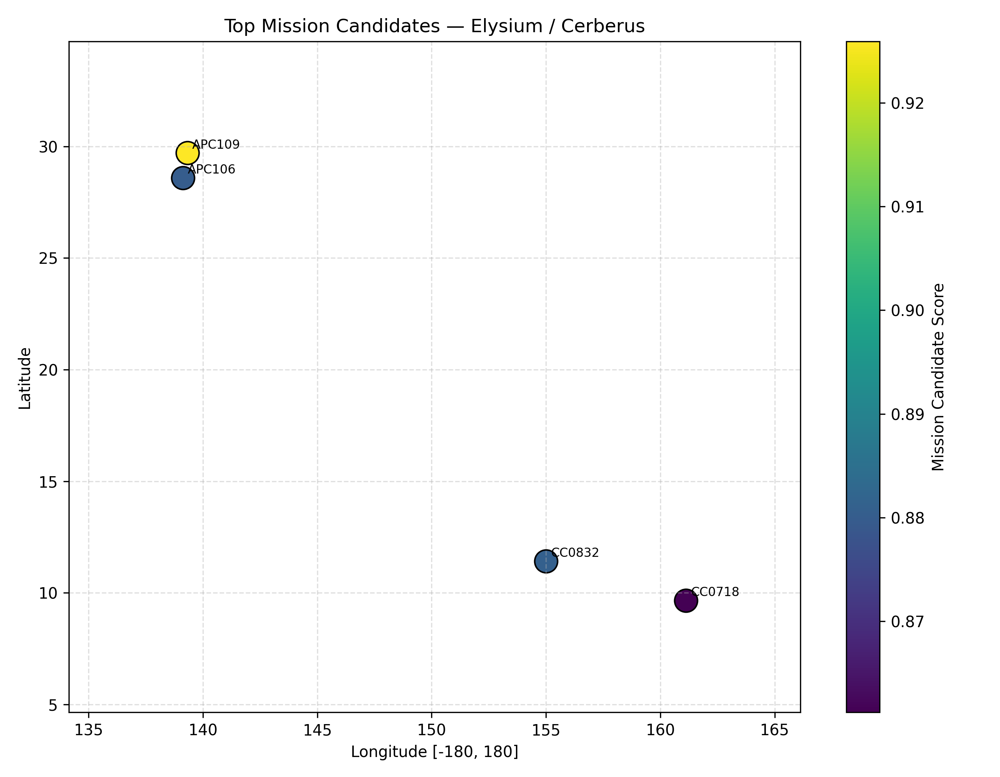

---

# Olympus / Western Tharsis

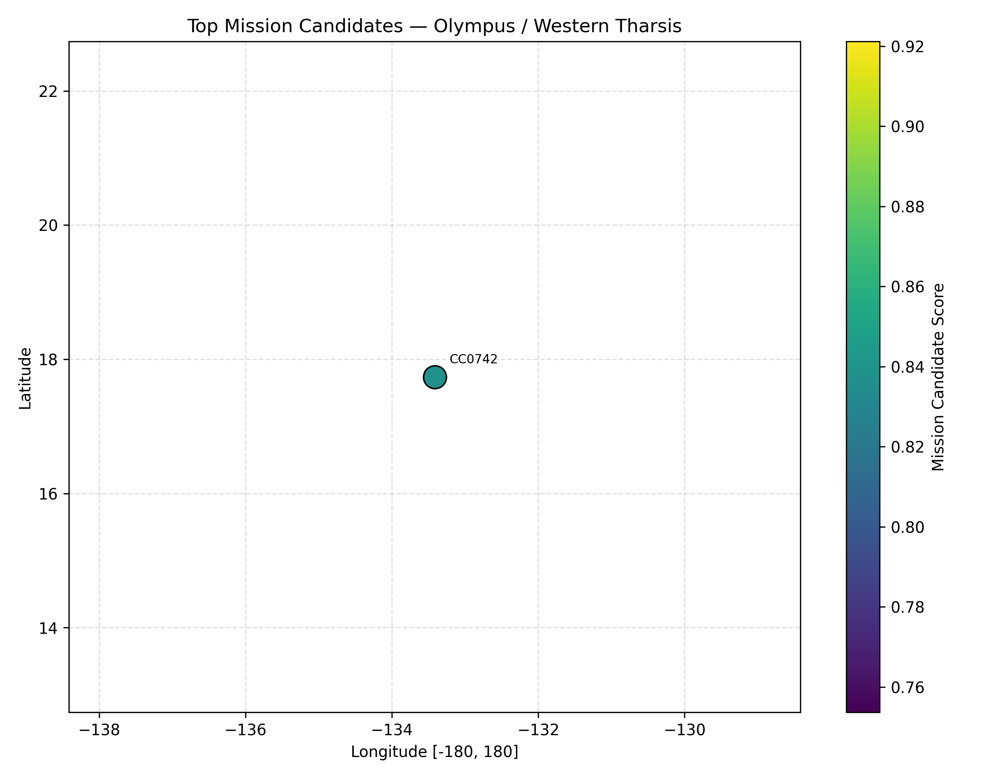

---

# Pavonis / Central Tharsis

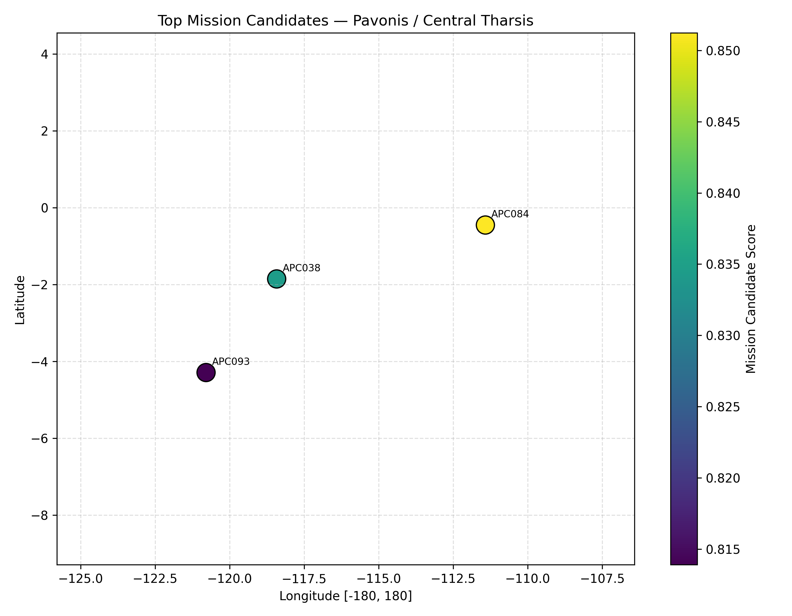

---

# Scientific Conclusions

The analysis revealed several major trends.

---

# 1. The Strongest Candidates Are Not Randomly Distributed

The best mission candidates cluster strongly in:

* Tharsis
* Elysium

This is consistent with:

* volcanic lava tube formation
* previous orbital observations
* geological expectations

---

# 2. Thermal Anomalies Are Extremely Important

The strongest candidates usually exhibit:

* high Delta TI
* strong local contrast
* elevated local z-score

This suggests:

* subsurface thermal insulation
* underground void preservation
* cave-like structures

---

# 3. Morphology Matters Significantly

The best candidates are frequently associated with:

* pits
* skylights
* aligned collapse chains

These morphologies are more likely to provide:

* direct underground access
* stable subsurface cavities
* habitat potential

---

# 4. Best Overall Regions

The strongest mission-oriented regions identified were:

## Tharsis Region

Especially:

* Arsia Mons
* Pavonis Mons
* Ascraeus Mons

These regions contain:

* dense volcanic terrain
* extensive lava flow systems
* multiple thermally anomalous pits

---

## Elysium Region

Also extremely promising because:

* several candidates show strong thermal anomalies
* morphology quality is high
* thermal contrast is significant

---

# Final Scientific Outcome

The project successfully produced:

* a complete global candidate database
* morphology filtering
* thermal analysis pipeline
* anomaly extraction framework
* mission-oriented ranking system
* publication-style visualizations
* top exploration candidate selection

---

# Most Promising Mission Candidates

The strongest overall candidates are concentrated in:

## 1. Arsia Mons / South Tharsis

because:

* strong thermal anomalies
* high-quality morphology
* volcanic context

---

## 2. Pavonis Mons / Central Tharsis

because:

* clustered skylight structures
* elevated thermal signatures

---

## 3. Elysium / Cerberus

because:

* extremely strong local Delta TI anomalies
* good morphology consistency

---

# Final Project Structure

## Main Scripts

```text
filter_global_candidates.py
filter_candidates.py
assign_themis_tiles.py
extract_thermal_features.py
plot_thermal_maps.py
select_strongest_mission_candidates.py
visualize_mission_selection.py
mission_selection_clear_visuals.py
```

---
